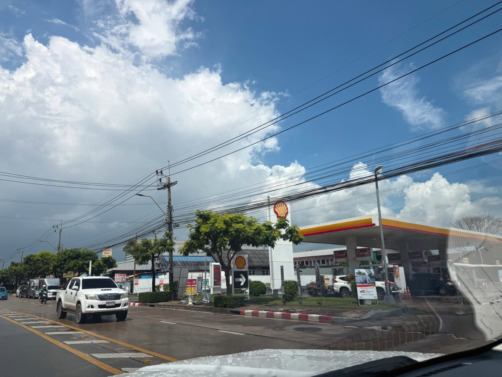

# 20250916_bangkok

<html lang="ja" data-loaded="false" data-scrolled="false" data-spmenu="closed">
<head>

<meta charset="UTF-8">
<meta http-equiv="Content-Type" content="text/html; charset=UTF-8">
<meta http-equiv="X-UA-Compatible" content="IE=EmulateIE10" />
<meta http-equiv="X-UA-Compatible" content="IE=edge">

<meta name="viewport" content="width=device-width, initial-scale=1.0">

<!--ここから上はお決まりの定型文です-->

<!--ここからが表現の書式などを決めるcssという部分-->

<link href="https://cdnjs.cloudflare.com/ajax/libs/lightbox2/2.7.1/css/lightbox.css" rel="stylesheet">

</head>

<body>

モバイル端末をお使いの場合は、画面を横向きにすると
背景画像の横方向がご覧頂けます。

<!--ここ上は、ほぼそのまま使います！-->

<!--QRコードの挿入例-->

 アクセス用QRコード

<marquee direction="left" scrollamount="20" width="30%">(^_^)/~alis</marquee>

<!--流れ文字の挿入例-->
<h1><marquee behavior="left">!!! 2025/09/14-16、街の電気屋さんから、生垣のお花達まで!!!</marquee></h1>

                          

<!--ここから下が、本体部分-->
    

 
<h2>14日、街の電気屋さん、仏壇の他に福神様、横で食事するおじさん</h2>

    
<h2>電気屋さんの正面入り口</h2>

    
<h2>一般家電もありますが、かなりマニアックな部品系までありました</h2>

    
<h2>昼下がりには街中をお散歩</h2>

    
<h2>仏壇脇の生垣のお花も綺麗に満開</h2>

    
<h2>セルラーのアンテナは乱立中</h2>

    
<h2>ショッピングモールでは日曜イベントが開催中</h2>

    
<h2>イベントの様子、動画↓</h2>

<iframe width="560" height="315" src="https://www.youtube.com/embed/UmJzPrsgLHk?si=ZhzWNBUOCoRDd0wy" title="YouTube video player" frameborder="0" allow="accelerometer; autoplay; clipboard-write; encrypted-media; gyroscope; picture-in-picture; web-share" referrerpolicy="strict-origin-when-cross-origin" allowfullscreen></iframe>
    

    
<h2>撮影係は女性でした</h2>

    
<h2>銀行入り口で整理券もらって、天井の掲示板に表示される番号で順番待ち</h2>

    
<h2>銀行の壁には王室の写真</h2>

    
<h2>衣料品店の壁に何やら掲示</h2>

    
<h2>複数購入でどんどん割り引くという仕組み</h2>

    
<h2>地下の食材フロアにおります</h2>

    
<h2>日曜の19時ごろはもう空いてます</h2>

    
<h2>晩御飯はチャーハン</h2>

    
<h2>遅い時間ですが、小さな女の子がウロウロ</h2>

    
<h2>お父さんに追いついたようです</h2>

    
<h2>40バーツのお菓子は、3つで100バーツ</h2>

    
<h2>19時半にはイベントが終わってスタッフ達が反省会</h2>

    
<h2>15日、朝のお花達が元気に満開</h2>

<h2>ピンクのお花はお寝坊さん、お昼過ぎの目覚めのようです</h2>

    
<h2>曇り空の街に朝日が昇ります</h2>

    
<h2>昼過ぎには周囲から入道雲</h2>

    
<h2>役場にお邪魔しました</h2>

    
<h2>役場を出ると孔雀の置物の向こうに入道雲</h2>

    
<h2>そのまま別の役場にもハシゴ</h2>

    
<h2>冷蔵庫を新調、配達員の一人は女性</h2>

    
<h2>女性は補佐で、おじさんが一人で担ぎました</h2>

    
<h2>新調した冷蔵庫</h2>

<h2>冷媒が落ち着くのを待つため、設置4時間後の電源ONを勧められました</h2>

    
<h2>晩御飯は市場のチャーハン</h2>

    
<h2>市場の鮮魚は新鮮 画像クリックで動画再生します↓</h2>

    
<h2>16日、明け方の雨で濡れた朝のお花達</h2>

    
<h2>街に登る朝日</h2>

         

<!--  
<h2>再掲【暑中お見舞い（ほたる）】LINEでご挨拶・動画で送る夏のグリーティングカード / ギターbgm/蛍の光・癒し動画</h2>

<iframe width="560" height="315" src="https://www.youtube.com/embed/Z4PKDOhRzfI?si=LaAJ8dA-1izGspEO" title="YouTube video player" frameborder="0" allow="accelerometer; autoplay; clipboard-write; encrypted-media; gyroscope; picture-in-picture; web-share" referrerpolicy="strict-origin-when-cross-origin" allowfullscreen></iframe>
    
   
-->   
    
    

  
<h2>今日のBGMは 【神回】ディズニー弾いてたら突然本物のディズニー歌手が登場して会場大パニックwww【ストリートピアノ】Disney songs on the street session</h2>

<iframe width="560" height="315" src="https://www.youtube.com/embed/LiC93_VZvtw?si=_0EFi366KaGpXfHH" title="YouTube video player" frameborder="0" allow="accelerometer; autoplay; clipboard-write; encrypted-media; gyroscope; picture-in-picture; web-share" referrerpolicy="strict-origin-when-cross-origin" allowfullscreen></iframe>
    

    
  
<h2>8月17日にメタバースで披露されたまいてゃさんの新曲「Lonely game」</h2>

<iframe width="560" height="315" src="https://www.youtube.com/embed/HstFJ2_8oQA?si=QrYNv_EcIm7fALkV" title="YouTube video player" frameborder="0" allow="accelerometer; autoplay; clipboard-write; encrypted-media; gyroscope; picture-in-picture; web-share" referrerpolicy="strict-origin-when-cross-origin" allowfullscreen></iframe>
    

    
    

    
    
    <h3>「雪の中で輝くシンデレラ」by まいてゃ</h3>
<h2><a href="https://torokoid.github.io/20250219_chiangrai/maitiyaz.mp3" target="_blank">この文字クリックで再生します 下の再生ボタンでも同じ曲をループ再生します</a></h2>

    <audio controls loop>
        <source src="https://torokoid.github.io/20250219_chiangrai/maitiyaz.mp3" type="audio/mpeg">
        お使いのブラウザは audio タグをサポートしていません。
    </audio>
 
    
<!--
  
<h2>スティーブ・ジョブズの伝説の講義</h2> 
<iframe width="560" height="315" src="https://www.youtube.com/embed/XsRpvWHIVw0?si=f7IA0pv9iZWVk3VH" title="YouTube video player" frameborder="0" allow="accelerometer; autoplay; clipboard-write; encrypted-media; gyroscope; picture-in-picture; web-share" referrerpolicy="strict-origin-when-cross-origin" allowfullscreen></iframe>    
    
    
<h2>スティーブ・ジョブズ氏の講義の内容が「笑って死ぬ」by まいてゃ さんの歌の内容と大筋で同じに聞こえます 以下に再掲しますね</h2>

    
<h3>歌の後半部分しか撮れてませんが、2月16日のイベントで公開された「笑って死ぬ」 by まいてゃ 白ドレスはダンサーの玖遠さん、黒いドレスがまいてゃさん</h3>
<iframe width="560" height="315" src="https://www.youtube.com/embed/s4ZcbxAluMM?si=Xa32xo19UCNaWv0v" title="YouTube video player" frameborder="0" allow="accelerometer; autoplay; clipboard-write; encrypted-media; gyroscope; picture-in-picture; web-share" referrerpolicy="strict-origin-when-cross-origin" allowfullscreen></iframe> 
-->
    

    <h3>お気に入りの「笑って死ぬ」 by まいてゃさんも再々掲です</h3>
<h2><a href="https://torokoid.github.io/20250221_chiangrai/maitiya3.mp3" target="_blank">この文字クリックで再生します 下の再生ボタンで同じ曲をループ再生します</a></h2>

    <audio controls loop>
        <source src="https://torokoid.github.io/20250221_chiangrai/maitiya3.mp3" type="audio/mpeg">
        お使いのブラウザは audio タグをサポートしていません。
    </audio>

   
<h2>以上、街の電気屋さんから、生垣のお花達まででした。 ここまでご覧いただきありがとうございました。</h2>

     
<h2>
<a href="https://torokoid.github.io/Mashiko_himawari_3/" target="_blank">クリックでメニューページに戻ります</a>
</h2>

   

<!-- hitwebcounter Code START -->
<a href="https://www.hitwebcounter.com" target="_blank">

あなたは 番目の訪問者です 数値は8月1日以降に立ち上げたバンコクシリーズHPの累計です
</a>   

         

  

      

<!--本体はここまで-->

<!--画面に空白地帯を作って、背景が見えるようにしています-->
                                              

<!-- フッタ -->
<footer>

Copyright 2025/09/16 alis @Bangkok

</footer>

<!--HPにさまざまなJavaScriptを呼び込むための書式-->

    
    </body>
    
</html>
